# Sandhi Ganjoo

This repo is a clone of https://github.com/varadbhogayata/varadbhogayata.github.io

## Activity 1
Repo:

## Activity 2
Repo:
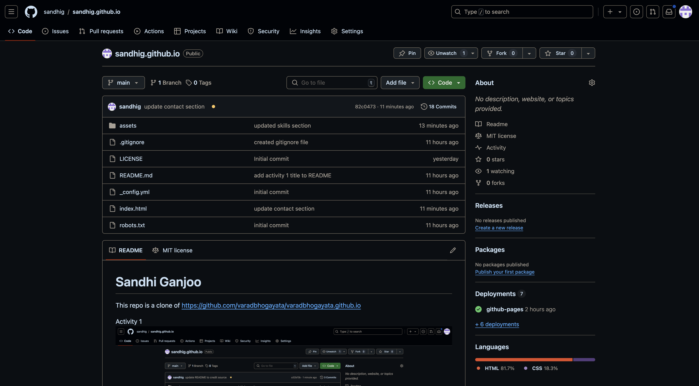

Website:

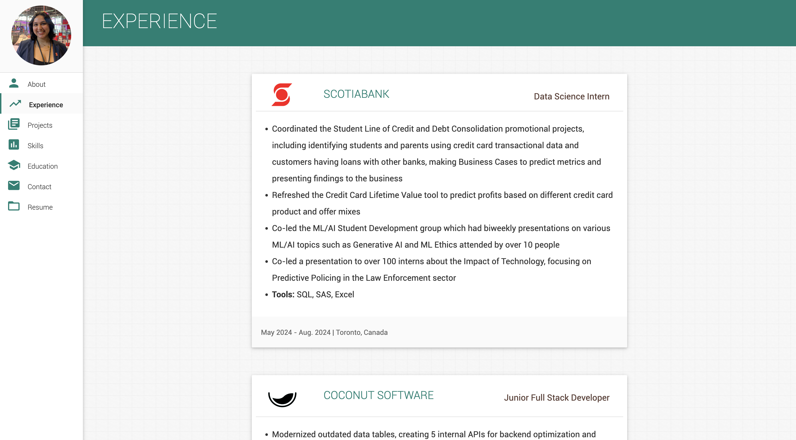

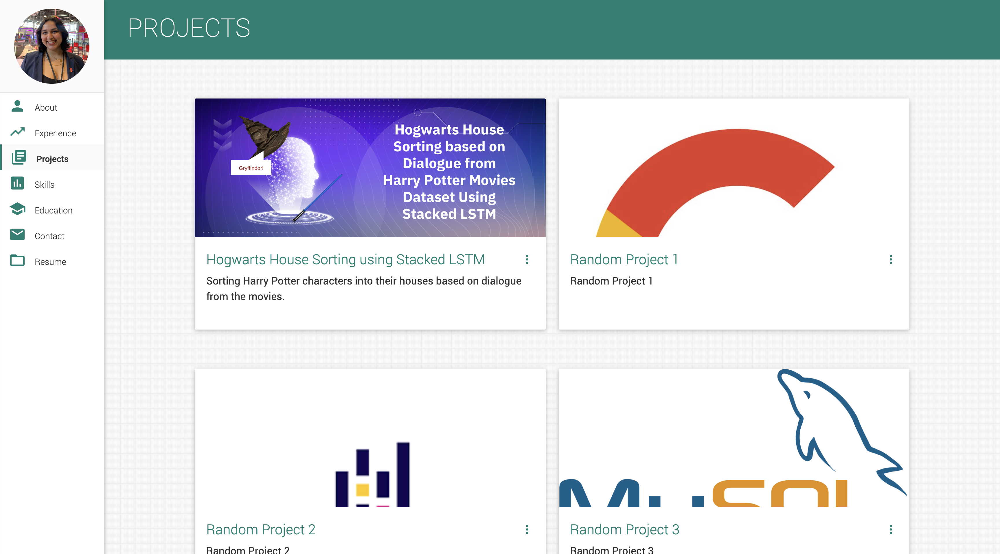

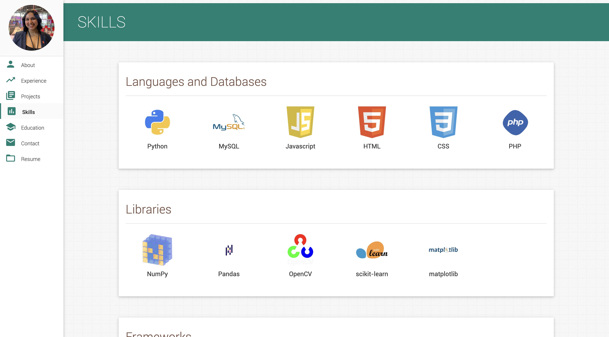

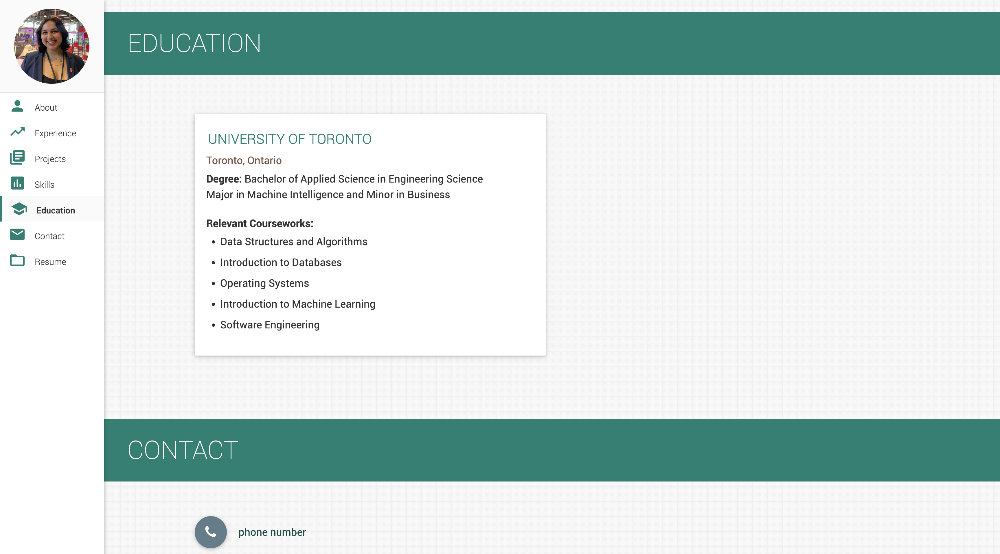

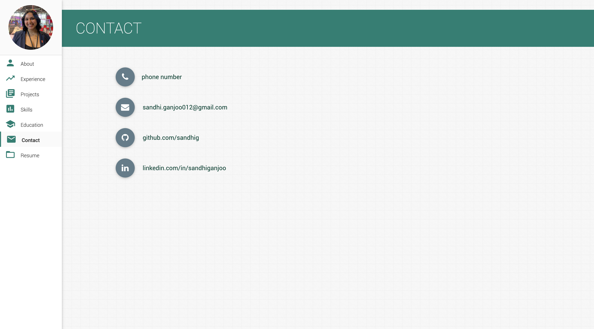

## Activity 3
Repo:
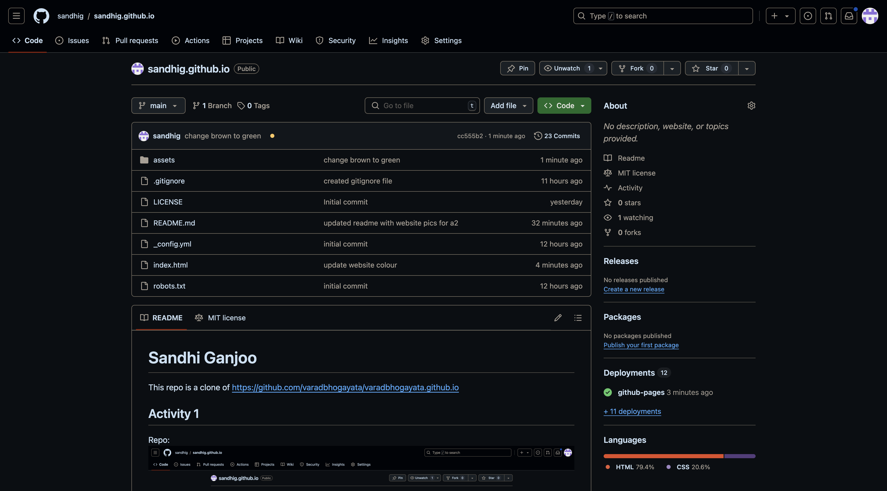

Website:
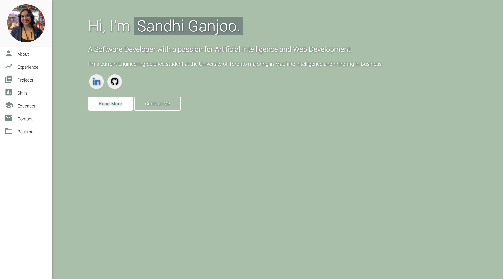

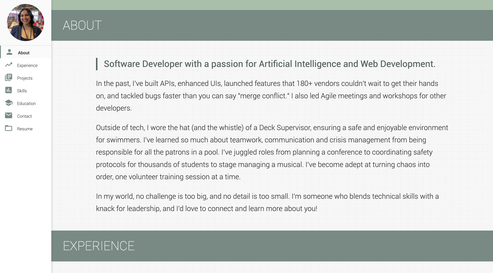

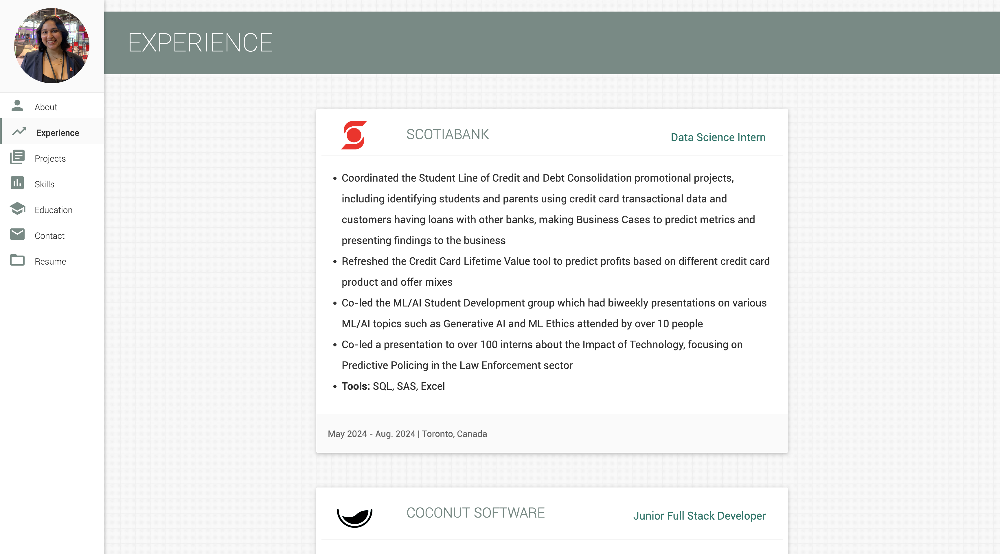

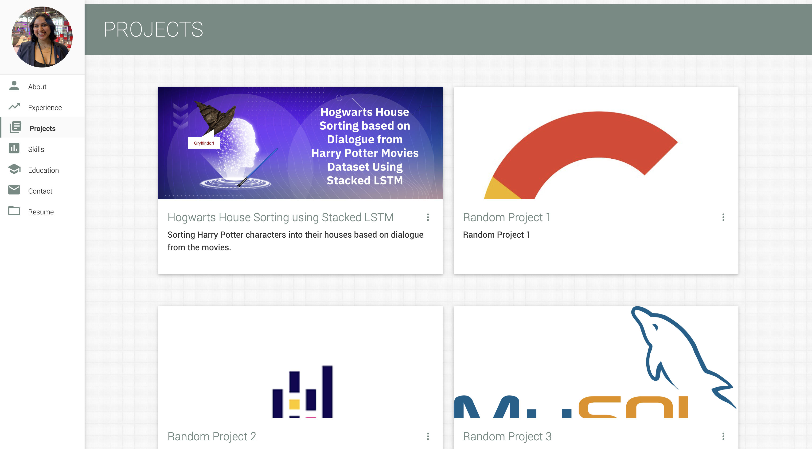

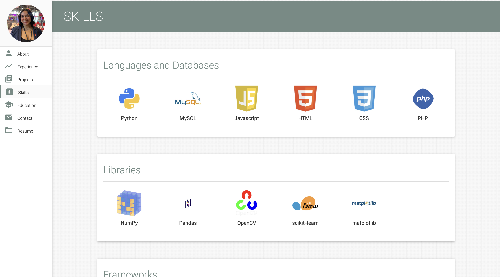

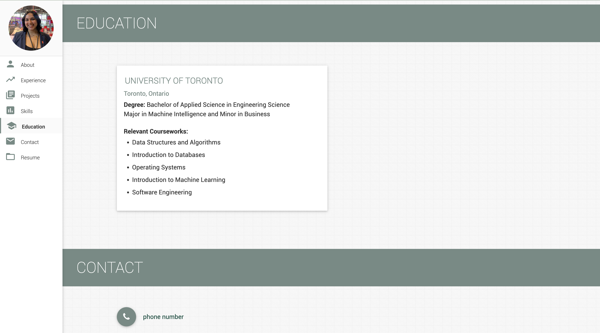

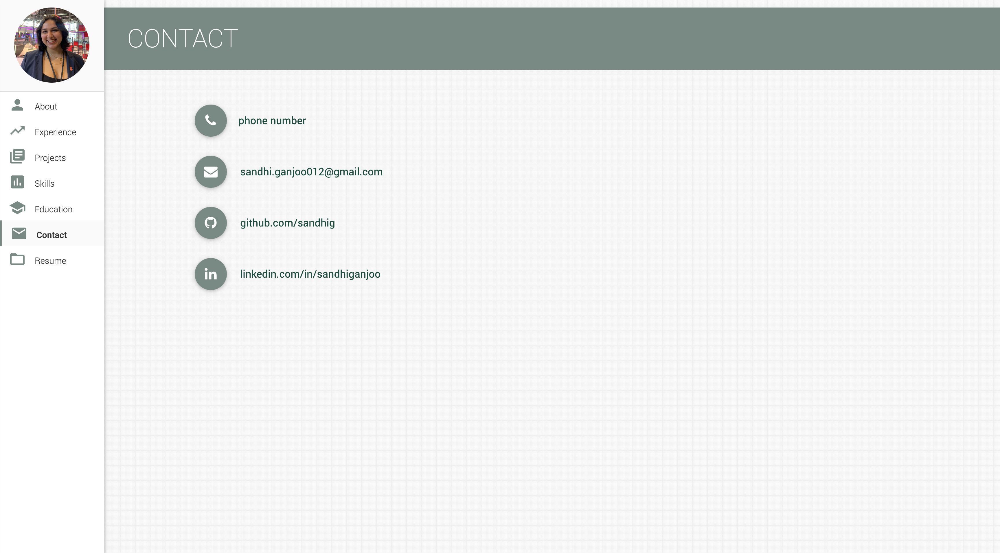

## Activity 4
Repo:
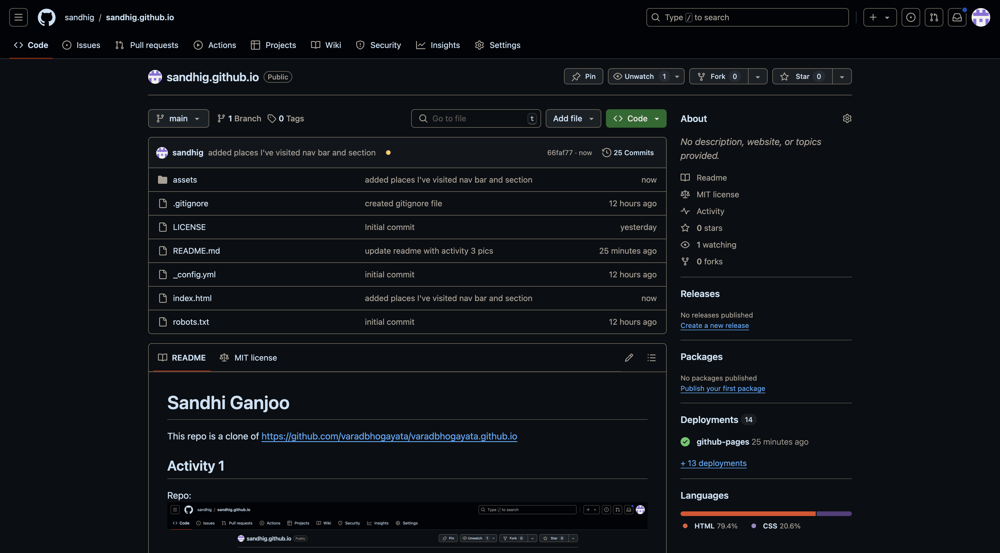

Website:

## Activity 5
Repo:
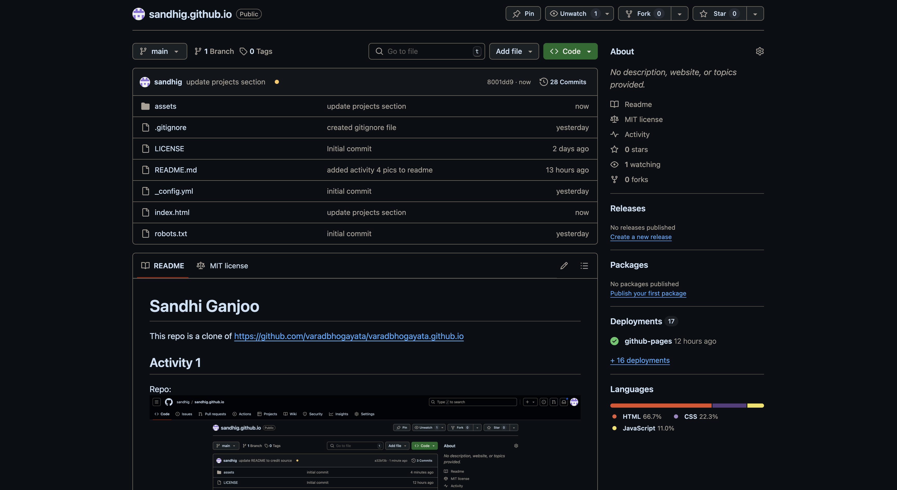

Website:
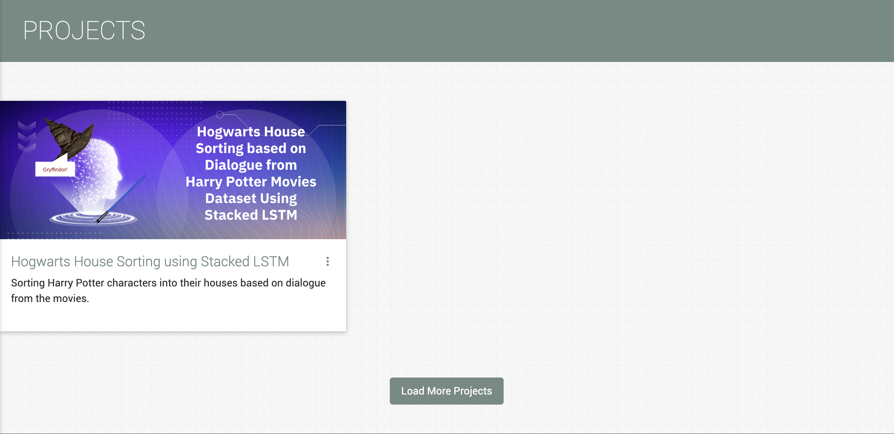